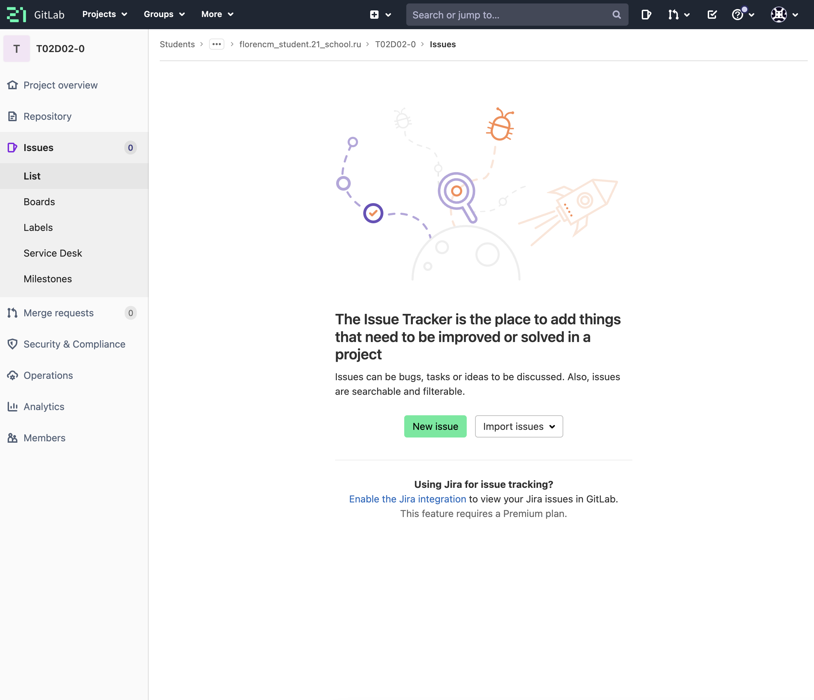

# Quest 5 (Bonus)

### 1. How to create repository?

To create your repository, you need to press button "New project" -> "Create blank project".
Then you need to choose "Initialize repository with a README". This will create simple readme.md file
For creating .gitignore, we need to press "New file", call it ".gitignore". That's all!

### 2. How to create develop and master branches

Master branch is creating in time, when you creating repository
To create develop branch, you need to press "New branch", enter branch name and press button "Create branch"

### 3. How to set develop branch default
To make develop branch default, you need go to Settings -> Repository and set a new default branch

### 4. How to create issue
To create an issue, you need go to Issues, press button New issue

### 5. How to create a branch for issue
To create branch for issue, you need to create branch named number-of-issue-description

### 6. How to create merge request on the develop branch
To create merge request, you need to open branch you created, choose source (our branch), choose target (develop) an press button create merge request

### 7. How to comment and accept merge request
To accept merge request, you need to go to "Merge requests", choose your merge request and press button merge

### 8. How to create a stable version in the master with a tag 
To create a stable version in master, you need to merge develop into master and then create a tag using command git tag tagname

### 9. Working with wiki for the project
Go to Wiki tab
Enter title, format, content etc.
WOW! You have a wiki page!